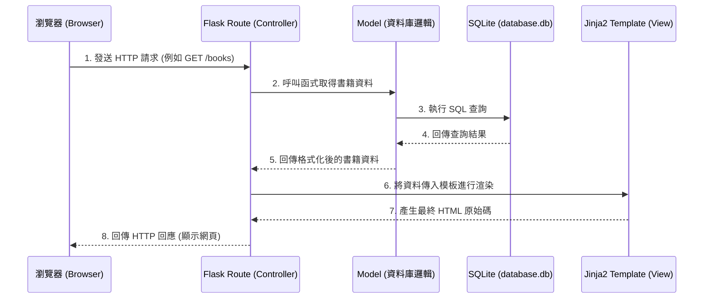

# 系統架構設計 - 讀書筆記本

## 1. 技術架構說明

本專案定位為輕量級的網頁應用程式，採用傳統的伺服器端渲染 (Server-Side Rendering) 架構，不區分前後端分離。

### 選用技術與原因
- **後端框架：Python + Flask**
  - **原因**：Flask 輕量、靈活且學習曲線平緩，非常適合用來快速開發中小型專案與 MVP。
- **模板引擎：Jinja2**
  - **原因**：與 Flask 高度整合，能直接在 HTML 中動態渲染後端傳遞的資料，開發直覺。
- **資料庫：SQLite**
  - **原因**：不需額外架設資料庫伺服器，資料儲存於單一本地檔案中，符合 PRD 中「支援本地檔案存檔」的需求，且比純 JSON 檔案擁有更好的查詢與關聯管理能力。

### Flask MVC 模式說明
本系統架構參考 MVC (Model-View-Controller) 設計模式：
- **Model (模型)**：負責與 SQLite 資料庫溝通，定義書籍與筆記的資料結構，處理資料的讀寫與邏輯運算。
- **View (視圖)**：負責呈現使用者介面。由 Jinja2 模板 (HTML) 與靜態資源 (CSS, JS) 組成，負責將接收到的資料顯示給使用者。
- **Controller (控制器)**：由 Flask 的路由 (Routes) 擔任。負責接收來自瀏覽器的 HTTP 請求，呼叫對應的 Model 處理資料，最後將資料傳遞給 View 進行頁面渲染。

## 2. 專案資料夾結構

以下為本專案的資料夾結構與各檔案的用途說明：

```text
web_app_development2/
├── app/                      # 主要應用程式目錄
│   ├── __init__.py           # 初始化 Flask 應用程式
│   ├── models/               # [Model] 資料庫模型與資料存取邏輯
│   │   └── database.py       # 負責初始化 SQLite 連線與資料表建立
│   ├── routes/               # [Controller] Flask 路由定義
│   │   ├── book_routes.py    # 處理書籍相關請求 (新增書籍、列表)
│   │   └── note_routes.py    # 處理筆記相關請求 (新增筆記、進度更新)
│   ├── templates/            # [View] Jinja2 HTML 模板
│   │   ├── base.html         # 共用的版型骨架 (導覽列、頁尾)
│   │   ├── index.html        # 首頁 / 書籍列表頁
│   │   ├── book_detail.html  # 書籍詳細資訊與筆記頁面
│   └── static/               # 靜態資源檔案
│       ├── css/              # 樣式表
│       └── js/               # 前端互動腳本
├── instance/                 # 存放本地資料庫檔案
│   └── database.db           # SQLite 實體資料庫檔案
├── docs/                     # 專案說明文件
│   ├── PRD.md                # 產品需求文件
│   └── ARCHITECTURE.md       # 系統架構文件 (本文件)
├── requirements.txt          # Python 套件依賴清單
└── app.py                    # 系統啟動入口檔案
```

## 3. 元件關係圖

以下展示使用者操作時，系統各元件之間的互動關係：



## 4. 關鍵設計決策

1. **採用 SQLite 取代純 JSON 檔案儲存**
   - **原因**：雖然 PRD 提到可用 JSON 存檔，但當書籍和筆記數量增加時，JSON 會面臨讀寫效率與關聯查詢（如：找尋某本書的所有筆記）的困難。SQLite 具備關聯式資料庫優勢，且同樣以單一本地檔案存在，完全符合輕便儲存的本地化需求。
2. **路由 (Routes) 模組化拆分**
   - **原因**：為避免所有路由邏輯都集中在單一的 `app.py` 中，將書籍邏輯 (`book_routes.py`) 與筆記邏輯 (`note_routes.py`) 拆分至 `app/routes/` 下，能大幅提升程式碼的可讀性與後續維護性。
3. **使用 base.html 模板繼承機制**
   - **原因**：透過 Jinja2 的模板繼承特性，將導覽列、頁首、頁尾等共同元件抽離至 `base.html`，可減少程式碼重複，確保全站設計風格一致，未來修改共用版面時也只需調整一處。
4. **保留前端 JavaScript 彈性**
   - **原因**：儘管主要由後端渲染頁面，但在 `static/js/` 中保留前端腳本空間。這便於未來實作如：刪除資料前的彈跳視窗確認、閱讀狀態切換的微互動等提升使用者體驗（UX）的功能。
