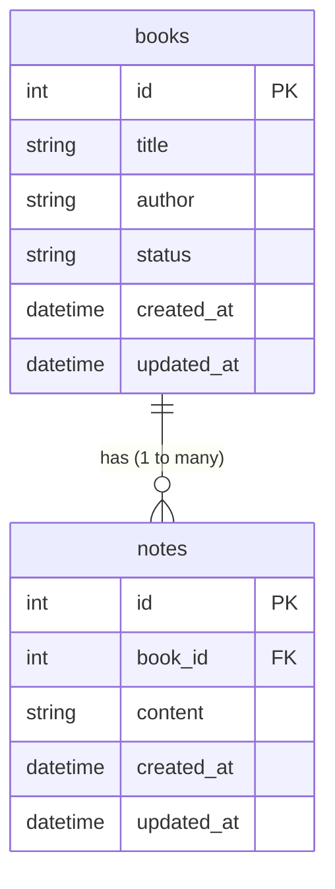

# 資料庫設計 - 讀書筆記本

本文件定義系統的 SQLite 資料表結構與關聯，並提供各資料表的詳細欄位說明。

## 1. ER 圖（實體關係圖）

## 2. 資料表詳細說明

### 2.1 books (書籍表)
儲存使用者的書籍資訊與閱讀狀態。

| 欄位名稱   | 資料型別 | 屬性 | 說明 |
|------------|----------|------|------|
| id         | INTEGER  | PK, AUTOINCREMENT | 書籍的唯一識別碼 |
| title      | TEXT     | NOT NULL | 書名 |
| author     | TEXT     | 可為空 | 作者名稱 |
| status     | TEXT     | DEFAULT 'unread' | 閱讀狀態：'unread' (未讀), 'reading' (在讀中), 'finished' (已完讀) |
| created_at | DATETIME | DEFAULT CURRENT_TIMESTAMP | 建立時間 |
| updated_at | DATETIME | DEFAULT CURRENT_TIMESTAMP | 最後更新時間 |

### 2.2 notes (分段筆記表)
儲存針對特定書籍的筆記內容與感想。

| 欄位名稱   | 資料型別 | 屬性 | 說明 |
|------------|----------|------|------|
| id         | INTEGER  | PK, AUTOINCREMENT | 筆記的唯一識別碼 |
| book_id    | INTEGER  | FK, NOT NULL | 關聯到 books 表的 id |
| content    | TEXT     | NOT NULL | 筆記內容 / 精采語錄 |
| created_at | DATETIME | DEFAULT CURRENT_TIMESTAMP | 建立時間 |
| updated_at | DATETIME | DEFAULT CURRENT_TIMESTAMP | 最後更新時間 |

## 3. SQL 建表語法
完整的建表語法已儲存於 `database/schema.sql`。

## 4. Python Model 程式碼
系統採用內建的 `sqlite3` 模組直接操作資料庫，Model 程式碼位於：
- `app/models/database.py`：負責資料庫連線初始化。
- `app/models/book.py`：負責 `books` 資料表的 CRUD 操作。
- `app/models/note.py`：負責 `notes` 資料表的 CRUD 操作。
