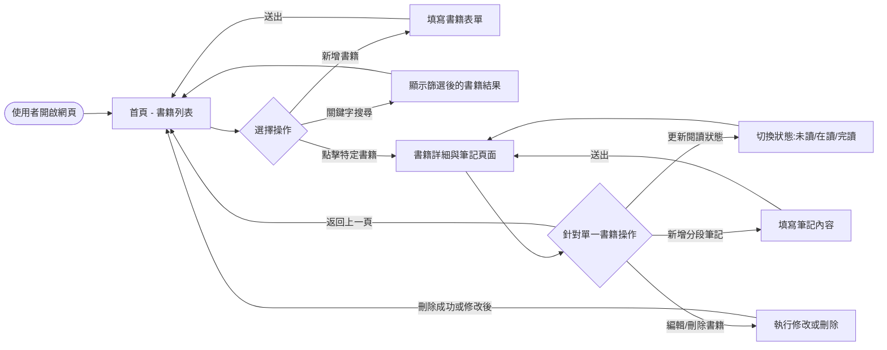
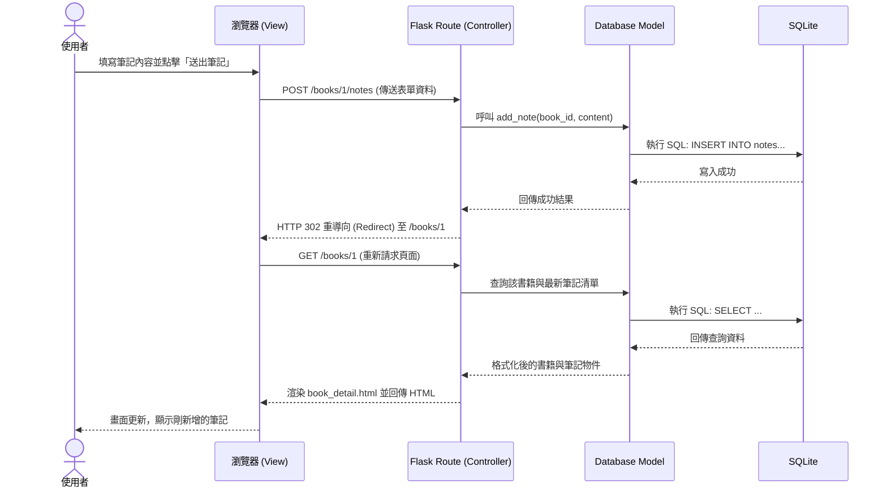

# 系統與使用者流程圖 - 讀書筆記本

本文件根據 PRD 需求與架構設計，繪製了使用者的操作流程圖與系統後端的序列圖，並整理了未來預計開發的功能路徑清單。

## 1. 使用者流程圖 (User Flow)

此流程圖描述使用者進入網站後，可以進行的各項主要操作路徑。

## 2. 系統序列圖 (Sequence Diagram)

此圖以「使用者新增分段筆記」為例，描述前端瀏覽器、後端 Flask 路由與 SQLite 資料庫之間的完整互動過程。

## 3. 功能清單對照表

根據上述流程，初步規劃系統功能對應的 URL 路徑與 HTTP 方法（可作為後續 API / 路由設計的參考）：

| 功能名稱 | URL 路徑 | HTTP 方法 | 說明 |
|----------|----------|-----------|------|
| 首頁 / 書架列表 | `/` 或 `/books` | GET | 顯示所有已建立的書籍清單 |
| 新增書籍 | `/books/add` | GET / POST | GET: 顯示新增表單 POST: 接收資料寫入資料庫 |
| 書籍詳細頁 | `/books/<id>` | GET | 顯示書籍資訊及該書的所有分段筆記 |
| 編輯書籍 | `/books/<id>/edit`| GET / POST | 顯示並送出書名、作者等修改資訊 |
| 刪除書籍 | `/books/<id>/delete`| POST | 刪除整本書籍與關聯的所有筆記 |
| 更新閱讀狀態 | `/books/<id>/status`| POST | 接收狀態變更請求並更新資料庫 |
| 新增分段筆記 | `/books/<id>/notes/add`| POST | 接收筆記內容並寫入資料庫 |
| 刪除分段筆記 | `/notes/<note_id>/delete`| POST | 刪除特定的一則筆記 |
| 關鍵字搜尋 | `/search` | GET | 根據 GET 參數（如 `?q=關鍵字`）搜尋 |
